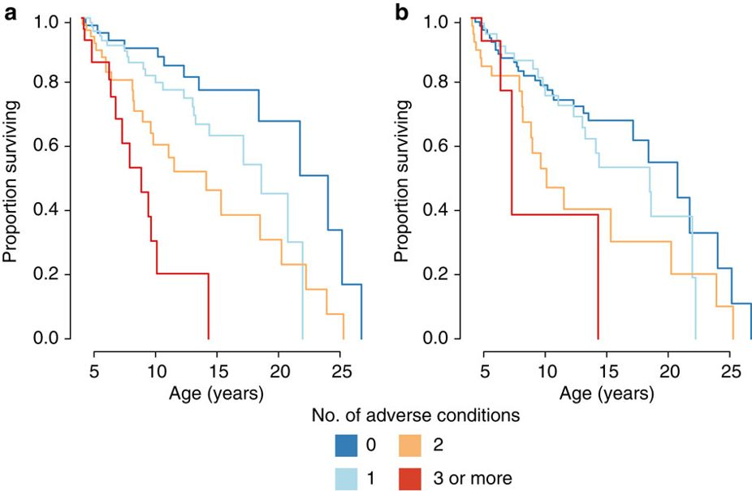

^[tiré de @tung_cumulative_2016, les deux courbes représentent la survie de babouines exposées à plusieurs conditions adverses au cours de leur enfance]


<style type="text/css">

body, td {
   font-size: 14px;
}
code.r{
  font-size: 11px;
}
h1{
  font-size: 24px;
}
h2{
  font-size: 18px;
}
pre {
  font-size: 12px
}
</style>

#Introduction

Si les cartes de fidélité ont moins d'attrait c'est qu'elles se sont multipliées, se concurrencent par le multihoming, et ont du souvent reconsidérer leur plan de gratification à la baisse, réduisant la valeur des points où relevant les seuils de statut, elles n'en restent pas moins le moyen principal pour les marques de suivre la consommation de leurs clients et demeurent un élément clé du système de gestion de la clientèle (CRM). Sans adhésion, sans  numéro, il n'y a pas de connaissance client.

Les distributeurs, les compagnies aériennes, les hotels, toutes les industries de services qui délivrent des prestations répétées à la guise du client, prétendent à modifier les achats subséquents en récompensant l'achat actuel. Ceci se traduit par une distribution de points à chaque achat, selon des barème plus ou mois complexes, mais dont on suppose qu'ils peuvent affecter l'achat suivant soit en le précipitant, soit en accroissant sa valeur monétaire. 

La question de leur efficacité est posée depuis longtemps, elle a été un de nos sujets de recherche (@meyer-waarden_impact_2006, @meyer-waarden_grocery_2009) . (un brief de la litt est nécessaire - à compléter)

L'étude qui fait l'objet de ce carnet de note, s'appuie sur un cas caractéristique, et vise à présenter des analyses comportementale de la relation par l'analyse des transactions. Autrement dit la liste des actes d'achat au cours du temps d'une cohorte de consommateursdont une possède une description sommaire.

Elle suit de près une publication encore plus ancienne qui portait sur un cas similaire, et avec une échelle de donnée équivalente @benavent_mesurer_1998 . On va y retrouver des éléments analogues qui font de cette étude une réplication positive qui confirme la généralité des résultats obtenus il y a bien longtemps. 

Cette étude reste cependant méthodologique et pédagogique et vise à détailler des analyses standards de ce type de structure de données, en particulier l'application de modèle de cox pour analyser la durée de vie des porteurs de carte de fidélité, un modèle linaire hiérarchique pour tester l'effet des récompenses acquises et de différents outils graphiques.


#Préparation des données

Les données sont relationnelles, à un niveau minimal. On dispose de 4 fichiers reliés par leur index :

 * Un fichier de 5000 clients qui ont adhéré au programme de fidélisation en 2010. Ils forment une cohorte, dont on suit retrospectivement (Le recueil des données est réalisée en 2014) les comportements.
 * Un fichier de leur tickets de caisse sur une période de 4 ans, lorsqu'ils ont présenté leur carte en caisse qui représente 57000 passage en caisse dont on connait la date, le client, et le montant.
 * un fichier des articles mentionnés dans chaque ticket de caisse (environ 200 000 lignes) et un fichier des références des articles et de leurs catégorie complète de la base, mais on ne les utilisera pas dans l'analyse suivante.

Même simple, cette structure conduit à une gymnastique des données, où pour produire les tableaux à analyser, il va falloir filtrer, merger, agréger. Dans cette esprit on consultera avec profit ce [chapitre d'un excellent ouvrage](https://r4ds.had.co.nz/relational-data.html) et on en profitera pour se mettre sérieusement à `dplyr`

On retiendra de cette structure dans une représentation simple le schéma suivant. Elle  se contruit avec trois éléments

 * Des individus i qui possèdent des caractaréstiques Xi à travers le temps
 * Une liste des évenements qui se déroulent après le relevé des caractéristiques des sujets et décrivent leur expérience de consommation. 
 * Des agrégations qui enrichissent le fichier des individus de caratères comportementaux dérivés de la séquence des achats, en particulier la durée écoulée entre le premier achat et le dernier.

##Initialisation

Voici la liste des packages néçessaires pour nos analyses. 

```{r setup, include=TRUE, echo=TRUE, message=FALSE,Warning=FALSE}
knitr::opts_chunk$set(echo = TRUE, include = TRUE, message=FALSE,Warning=FALSE)
library(tidyverse) #la boite à outils qui monte qui monte, indipensable pour les graphique , indiemnsable pour reconstruire les données
library(reshape2) #indispensable pour ggplot
library(readr)
library(Rcmdr)     # si on a besoin d'interactivité
library(survival)  #le coeur de notre analyse
library(survminer) #un outil pour bien représen,ter la survie ou le rique
library(lubridate) #bien utile pour manipuler les dates
library(gglorenz)  #analyse des concetration autrement la verification des 20:80
library(ineq)      # un complement aux analyse de concentratrion
library(jtools)
library(lme4)      # pour des regressions complexes
library(nlme)      # pour des regressions complexes mais aussi d'autres méthodes
library(effects)   #tester etr reprensenter des effets d'interactions
library(ape)       #ape est le pacckahe de la phylogénie mais fournit des ressources essentielle pour mieux pratiquer le clusting
library(gridExtra) #question de mettre des graphique dans un meme espace
library(viridis)   #pour les couleurs
library(knitr) 
library(kableExtra)#affichage des tableaux
library(stargazer) #pour comparer les modèles de regression et de survie

#lecture des fichiers
#la cohorte des nouveaux adherents 
Customer <- read.csv("~/AtelierR/botanic/Custom.csv", encoding="UTF-8")

#passages en caisse (tickets) sur 4 ans
Purchase <- read.csv("~/AtelierR/botanic/Purchase.csv")
```


#Description de la série

Pour obtenir un sens plus concrêt des données en voici une représentation simple : le nombre de transactions journalières effectuées par les clients qui ont adopté la carte en 2010 au cours des quatre années suivantes. Compte-tenu de la nature historique des données on utilisera le package `lubridate` pour manipuler les dates, les temps et les durées.

On y observe :
 * une saisonnalité prononcée avec un pic au printemps (quand le jardin se prépare) et en décembre quand il faut trouver des idées de cadeaux.
 * une baisse du nombre absolu des achats qui traduit l'attrition, les membres du programme disparaissent, soit qu'ils n'utilisent plus la carte pour bénéficier des avantages (les points) soit qu'ils ne sont plus clients de l'enseigne.

```{r time02, caption="Evolution du nombre de passages en caisse"}
Purchase$Date<-as.POSIXct(Purchase$Date) #un format qu'aime lubridate
g<-Purchase %>% 
  ggplot(aes(Date)) + 
  geom_freqpoly(binwidth = 86400) + labs(title = "Nombre d'achats par jour",caption = "Archives personnelles",x="temps",y="nb de passage en caisse") 
g

# le choix du binwidth est justifié par ce que  86400 seconds = 1 day
```

Pour mieux représenter la saisonnalité, identifions le nombre moyen d'achats par jour de la semaine, par jour du mois, et par mois de l'année. On y retrouve un fort rythme saisonnier (avril/mai; décembre), un rythme hebdomadaire qui concentre les ventes le we, et dans une importance moins nette des achats un peu plus denses en début de mois mais c'est à prouver.  Les achats se font vers 11h ou 17h. 

```{r time1, caption="saisonnalité des ventes"}
g0<-Purchase %>% 
  mutate(heures = hour(Date)) %>% 
  ggplot(aes(x = heures)) + geom_bar(fill="orange")+theme_minimal()

g1<-Purchase %>% 
  mutate(wday = wday(Date, label = TRUE)) %>% 
  ggplot(aes(x = wday)) + geom_bar(fill="orange")+theme_minimal()


g2<-Purchase %>% 
  mutate(mday = mday(Date)) %>% 
  ggplot(aes(x = mday)) +  geom_bar(fill="coral3")+theme_minimal()

g3<-Purchase %>% 
  mutate(Month = month(Date, label = TRUE)) %>% 
  ggplot(aes(x = Month)) +geom_bar(fill="brown")+theme_minimal()

grid.arrange(g0,g1,g2,g3,nrow=2)
```


#Analyse de l'attrition

C'est un enjeu essentiel que de comprendre l'attrition des clients. Pour l'apprécier, on emploie les ressource de l'analyse de survie. Comment modéliser les chance qu'un souscripteur à la carte soit toujours client au bout d'une durée t ? 


##Les durées de vie des clients

Examinons les durées écoulées entre l'adhésion et le dernier achat. On trouve des pics annuels qui correspondent vraisembablement  aux dates de renouvellement, ou plutôt de non-renouvelement de la carte. Ils sont à peu près annuel (365 jours). On note naturellement le pic initial correspondant aux achats uniques, ceux qui ont été produit au moment de l'adhésion et n'ont pas fait d'autres achats. Soit que les clients aient disparus, soit qu'ils n'utilisent pas leur carte.

On calcule séparemment sur la base du fichier des achats la plus faible et la plus forte des valeurs ( le premier et le dernier achat) qu'on matche en un fichier donc l'index est l'individu. La durée de vie est calculée en faisant la différente des dates de premier et de dernier achat. Il n'y a plus qu'à examiner l'histogramme des durées de vie ( exprimée en jour).

```{r duration01, caption ="Distribution des durées de vie"}
c1<-group_by(Purchase, idclient) %>% summarise(mind = min(Date))
c2<-group_by(Purchase, idclient) %>% summarise(maxd = max(Date))
c1<-cbind(c1,c2[2])

c1<-c1 %>% mutate(duration=as_date(maxd)-as_date(mind))
c1<-as.data.frame(c1)
g<-ggplot(c1,aes(x = duration))+geom_histogram(binwidth =5)+xlim(1,1600)+ annotate("text", x = 500, y = 100, label ="la durée 0 jour n'est pas représentée \n la fréquence de cette modalité est de plus de 800")+theme_minimal()
g

```

##Définition de la variable de censure

Ces données se prêtent parfaitement à des analyses de survie, il faut cependant indiquer si ces durées sont censurée ou pas. Autrement dit  quelque soit leur durée, si l'evenement a été observé ou pas. Cet évenement est la disparition du client qui ne refaira plus d'autres achats. S'il n'est pas observé, il est probable que la durée d'échat s'étendra audelà de la date d'observation, mais nous ne le savons pas. La cience des modèles de survie c'est de prendre en compte ce facteur pour donner des estimations qui ne soit pas biaisées. On comprend que si on prend les durée telles quelles, on en minise la durée moyenne.

(insérer un graphique des durées)

La censure  est donc la variable qui signale si, à la date de l'étude, l'événement s'est produit ou ne s'est pas encore produit, implicant que la durée mesurée est la durée minimale et qu'on en connaît pas encore la valeur exacte. On peut s'appuyer sur deux méthodes :

* la première prend en compte la date de non renouvellement de la carte de fidélité

* la seconde s'appuie sur l'analyse des achat et un critère simple qui est celui d'un critère de décision discrimant les derniers achats marquant l'arrêt définitif, de ceux qui sont simplement les derniers achats observés.

c'est la seconde méthode que l'on choisit. Le critère de décision va s'appuyer sur le calcul d'une durée écoulée entre le dernier achat observé et la date de l'étude pour tenir compte de la variabilité individuelle. Si cette durée est significative plus grande que la durée inter-achat, on en déduit que la probabilité que le client a disparu est élevée.

Mais auparavant représentons ces durées inter-achats pour ceux qui ont réalisé plus de deux achats. On retrouve une distribution centrée sur une trentaine de jour. Le rythme serait ainsi plutôt mensuel.


```{r duration02, caption ="Censure et durée inter-achat"}
Purchase$n<-1
c2<-aggregate(n~idclient,data=Purchase,sum )
end <- as.POSIXct('2014-1-1') #fixer la date d'étude
#calculer la duree interachat durée-totale/nombre d'achats et la durée ecoulée depuis le dernier achat - ne garder que ceux qui ont fait deux achats
c1<-cbind(c1,c2[2])  %>% mutate(fq=duration/n) %>% mutate(last= end-maxd ) %>% filter(n>1)
#initialiser la censure à 1 
c1$censure<-1
#donner la valeur de 2 si la duree ecoulee est superieure à 2x la duree inter achat.
c1$censure[c1$last>2*c1$fq]<-2
c1$censure<-as.factor(c1$censure)
#afficher la distribution des durées interachats
ggplot(c1,aes(x=fq,group=censure))+geom_density(binwidth = 10)+xlim(0,400)+ labs(x = "durée inter-achat (en j)")+theme_minimal()+facet_grid(censure~.)
```


##Une première approche par la méthode de Kaplan-Meyer

Elle est univarié, elle est actuaire, elle représente les données sans explication sauf à comparer des groupes distincts, elle donne l'allure du phénomène. C'est en 1958 qu'elle a été inventée, en voici le [texte fondamental](https://web.stanford.edu/~lutian/coursepdf/KMpaper.pdf), et un [commentaire collector de 1983](http://www.garfield.library.upenn.edu/classics1983/A1983QS51100001.pdf).

On y relève deux points d'inflexion qui correspondent au rythme annuel du renouvellement (la carte est payante pour une somme modique et valable un an). Au premier point, à moins de 400 jours c'est la moitié des adhérents qui disparaissent. Au bout de 3 ans il en reste un peu plus de 20%. 


```{r duration03, caption ="Méthode Kaplan meyer"}
c1<-merge(Customer,c1, by.x="idclient",by.y="idclient", all.x=FALSE, all.y=FALSE, sort=TRUE)

#kaplanmeier
c1$SurvObj <- with(c1, Surv(duration, censure == 2))
km <- survfit(SurvObj ~ 1, data = c1, conf.type = "log-log")
km
plot(km)
```

##Modèle de Cox

Le génie du modèle de Cox est de modéliser le risque en deux composantes. La première est la forme générale du risque qui prend l'allure d'un vecteur numérique du temps, sans aucune spcéfication de loi, un modèle purement paramètrique, qui est pôndéré par une seconde composante, une fonction linéaire des caractériques de l'objet dont on souhaite mesuré la survie. On consultera Cox pour le texte séminal et pour la mise en oeuvre sous.

C'est au fond un modèle de régression ou le terme constant est remplacée par une courbe de risque, sa propriété est de conserver au cours du temps les rapports de risque. Sa formalisation est la suivante :

$$h_{it}=h_{0,t}\exp^{X_{i}\beta}$$

On utilise le package `survmining` et pour aller plus loin on consultera avec profits ce [lien](https://www.ncbi.nlm.nih.gov/pmc/articles/PMC5220043/) et le  [suivant](http://www.sthda.com/english/wiki/survival-analysis-basics).

Dans la séquence suivante on spécifie le modèle, puis avec la fonction `cox.zph` on evalue la proportionnalité des risques. Les deux dernières lignes sont destinées à représenter les courbes de survie et de risque cumulé pour une variable qui attire notre intention. C'est une reprensation stratifiée


```{r duration04, caption ="Méthode de Cox"}

#cox
res.cox1 <- coxph(SurvObj ~  C_sms + C_mail + C_email+Habitat+segment, data =  c1)
res.cox1
(res.zph1 <- cox.zph(res.cox1))
#plot(res.zph1)
c1$duration2<-as.numeric(c1$duration)
fit <- survfit(Surv(duration, censure==2) ~ C_mail, data = c1)
library(survminer)
ggsurvplot(fit, data = c1,conf.int = TRUE)
ggsurvplot(fit, data = c1, fun = "cumhaz",conf.int = TRUE)
```

Une variable semble faire la différence : le fait que le souscripteur aie acceptué de donner son addresse terrestre. En acceptant de s'identifier il signale son comportement futur : plus fidèle. On s'apercoit memem quand on examine le diagramme des taux de risque cumulé qu'il échappe à l'exode de la quatrième année.

Ce modèle simple fait de la survie des clients en tant que client fidélisé le résultat de caractéristiques intrinsèque à l'individu. L'exemple des adresse de contact révèle que la fidélité se rélève par le consementement du client à être recontacter. S'il laisse son adresse mail, terrestre ou mobile, c'est qu'il est dans une disposition favorable et la preuve vient de ce que systématique le taux de risque est plus faible pour ceux qui ont donnés leur coordonnées au moement de l'adhésion. Les actes d'achats sont observés de manière postérieure et sont ainsi indépendant de l'état antérieur. La causalité est établie mais sa nature est interprêtée. donner son adresse c'est traduire une attitude persistante.

Les tests de non-proportionnalité sont importants car il permettent de justifier pour les variables introduite dans la partie deterministe du modèle l'idée un effet constant, indépendant du temps. La proportionnalité des taux de risque est fixée dans la nature même du modèle.

Considérons  un modèle très simple réduit à une variable binaire : on possède le mail qu'il a donné ou on a pas l'information codé 1 ou 0.Examinons le rapport des risques pour les deux modalités. Le rato des risque est égal à une constante dont la valeur dépend d'un  paramètre. Les rapport de risques sont constant.


$$\frac{h_{0,t}\exp^{1\beta}}{h_{0,t}\exp^{0\beta}}= \exp^{\beta}$$


Le rapport des probabilités de survie reste constant à travers le temps. Dans notre cas ces proportionnalités sont testées par le test rho et par des graphiques. Ces derniers traduisent une parfaite parrallélisme.

####Des variables qui varient dans le temps

Dans notre cas, d'autres variables que celles qui décrivent les individus sont disponibles, en particulier la connaissance des dates d'achat au cours de la vie du client. Il est parfaitement légitime de penser que ces expériences d'achats soient susceptibles d'affecter la continuence des achats ( note de bas de page sur la continuance). Chaque acte d'achat est l'occasion d'éprouver la marque et ses produits, si l'expérience est possitive on s'attend à ce que le client soit incité à répéter et à prolonger sa vie de client. les expériences négatives risque de réduire la survie.

Les actes d'achats sont ainsi des variables qui varient dans le temps et ont un effet présumés qui se distibuent dans le temps en fonction de leur apparition.

le modèle est donc

sur un plan pratique on va utiliser des ressources de tmerge qui est une fonction difficile à utiliser. Elle crée les variables dont nous avons besoin : des départs, des fins, des censures, des evenements, pour présenter les données sous une forme qui enregistre les individus et les séquences marqué par un début de vie, des évenements, et une fin de vie ou une censure .

i tstart tstop evenement actions censure
1  0        50              1       
1 51        102             1       
1 103       116     1               1 
2
2

pour structurer les données on emploie la fonction tmerge qui est délicate et complexe à mettre en oeuvres, mais ensuite très éfficace pour construire le fichier de données nécessaires. Ce document est utile pour une [première approche](http://daynebatten.com/2016/01/tmerge-customer-churn-data/) et on consultera la [vignette](https://cran.r-project.org/web/packages/survival/vignettes/timedep.pdf), si necessaire on regardera cette présentation (https://www.google.com/url?sa=t&rct=j&q=&esrc=s&source=web&cd=4&cad=rja&uact=8&ved=2ahUKEwiW58Pc5IbhAhWInxQKHVwACNoQFjADegQIBBAC&url=https%3A%2F%2Fww2.amstat.org%2Fmeetings%2Fsdss%2F2018%2Fonlineprogram%2FViewPresentation.cfm%3Ffile%3D304494.pdf&usg=AOvVaw0RCQfeZHAVih5vsiP8Fszl)

On estime le modèle avec la meme procedure ci-dessus, excepté qu'on introduit dans le modèle deux nouvelles variables : le fait qu'un achat ( un passage caisse, une visite en magasin) soit réalisé, et le cumul des achats réalisés jusqu'au temps t.
analyser les résultats : on s'apercoit qu'aussi bien le cumul des achats que l'évenement achat tendent à accroitre la survie ( expliquer le signe négatif)

```{r duration06, caption="with time covariate"}
#preparation fichier

c1_f<-c1 %>% filter(duration>0)

c1_pf<-merge(c1_f,Purchase[,2:6],by="idclient", all=FALSE)

c1_pf$time<-round(as.POSIXct(c1_pf$Date)-as.POSIXct('2010-1-1'),0)

newdata <- tmerge(c1_f, c1_f, id = idclient, action = event(duration,censure))

newdata2<- tmerge(newdata,c1_pf, id = idclient, purchase = event(time, Montant), cumul=cumevent(time, Montant))

fit <- coxph(Surv(tstart, tstop, action==2) ~ C_mail +status+purchase, data=newdata2)
fit2 <- coxph(Surv(tstart, tstop, action==2) ~ C_mail +status+purchase+cumul, data=newdata2)


stargazer(fit,fit2,type = "text")

```

####Des paramètres qui dépendent du temps

On sait donc introduire dans un modèle de survie, le modèle de Cox, deux types de variables, des variables invariantes au cours du temps qui exercent un effet proportionnel constant au cours du temps, et d'autres donc la valeur variant au cours du temps peuvent affecter de manière différentielle les espérances de survie.

On peut encore envisager des variables dont l'état ne varient pas mais l'effet croit ou décroit avec le temps. Un modèle simple permet de rendre compte de ce type d'effet. Supposons que la survie S dépendent d'une variable X dont le paramètre est a. S=f(X,a). On peut supposer aussi bien que a soit fonction de la durée écoulée. Le temps s'accumulant ( une seconde à la fois conduit à 8600 seconde dans une journée) on aura volontier tendance à utiliser une fonction log : a(t) = a log(t)

Si a est positif l'effet s'accroit avec le temps, s'il est négatif il décroit. 

C'est ce que nous allons tester. 

la modélisation de la dynamique du paramètre est donc fonction de f(t). si c'est une fonction log, on suppose que que le paramètre s'accroit de manière décroissante avec le temps. si c'est une fonction exp c'est une croissance ou décroissance exponentielle selon le signe. 


```{r duration07, caption ="Méthode de Cox avec paramètre variant dans le temps"}

#cox
res.cox1 <- coxph(SurvObj ~  segment+ C_sms +C_email + C_mail +tt(C_mail), data =  c1, tt = function(x, t, ...) x * log(t+1))
res.cox1
#plot(res.zph1)
```

Dans notre cas le fait de posseder le mail réduit fortement le risque, il est de 0,4 quand on possède l'addresse que quand on la possède pas. Pour comprendre la dynamique temporelle examinons la variable ttc( c_mail). le paramètre est de 0.08, autrement dit chaque fois que la durée double, l'effet de la possession du mail se réduit de 8%.

avec un peu d'arithmétique et de simulation on peut tracer le graphe de l'impact de cette information dans le temps. En un an l'impact du paramètre s'est réduit de moitié.


```{r duration08, caption ="paramètre variant dans le temps"}
t<- as.data.frame(c(0:1000))  #on examine la variation sur 1000 jours
t$t<-t[,1]                    #on fixe la variable  temps
z= 1                          #un paramètre pour lineariser
t$logt<-log(z+t$t)            #on calcule le log du temps ( linéarisé)
beta<- (-.89194)              #la valeur primaire du paramètre de la variable dont le variable varie dans le temps
a<-0.08035                    #l'effet du temps sur le paramètre
t$parameter<-beta+(a*t$logt)  #la valeur du paramètre dans le temps
#representation graphique
ggplot(t,aes(x=t,y=parameter))+geom_point()+theme_minimal()
```


#analyse des tickets de Caisse

Revenons à l'analyse des transactions, et examinons leurs distribution en fonction des montants. Elle semble suivre une loi exponentielle, ou puissance. On observe des valeurs négatives qui correspondent à des erreurs ou des remboursements. 


```{r ticket01}
ggplot(c1_pf, aes(Montant)) + geom_histogram(binwidth=5)+
labs(title="distribution des montants",
     y = "Nombre", x="Montant du ticket")+theme_classic()+xlim(-100, 300)
```


On ne prendra en compte que des valeurs strictement positives.

On exclue de l'analyse les achats opportunistes, ceux qui n'ont lieu qu'une fois et incite à prendre la carte de fidélité pour bénéficier d'un avantage immédiat.La carte joue pour ces clients le rôle d'une promotion. On pourrait s'interroger du la proportion d'entre eux qui aurait réaliser l'achat sans cette opportunité. 

La distribution confirme le raisonnement dans la mesure où les montant sont de l'ordre d'une centaine d'euro. Curieusement une autre population de ticket à faible montant se manifeste : probablement des achateurs de babioles à 10 euros, qui se promenant en profite pour prolonger l'expérience de visite en souscrivant à la carte, mais ils sont peu nombreux, disons une centaine.

```{r ticket02}
#c1_pf<-merge(c1_pf,c1, by="idclient",all.x=FALSE, all.y=FALSE, sort=TRUE)%>%filter(Montant>0)%>% filter(n.y>1)

ggplot(c1_pf, aes(Montant)) + geom_histogram(binwidth=5)+
labs(title="distribution des montants",
     y = "Nombre", x="Montant du ticket")+theme_minimal() +xlim(0, 500)


```

##l'évidence des 20/80

La bonne vieille loi du commerce : 20% des clients font 80% du chiffre d'affaire et de la marge et cette idée de concentrer sur eux l'essentiel des efforts même s'ils sont aussi la cible des concurrent. cette règle qui conduit à s'exposer à la disruption par une qualité excessive. 

Cette loi de concentration  est celle que représente  la courbe de lorentz : https://en.wikipedia.org/wiki/Lorenz_curve. On utilise à cette fin le package [gglorenz] (avec le package https://github.com/jjchern/gglorenz)

l'enjeu c'est de mesurer la concentration du CA par les ventes les plus élevées.

```{r ticket03, caption="Distribution des montants des tickets de caisse"}
Mediane<-round(median(c1_pf$Montant,na.rm = TRUE),2)
g1<-ggplot(c1_pf, aes(Montant)) + stat_ecdf(geom = "step")+
labs(title="Empirical Cumulative \n Density Function",y = "F(Proportion cumulée)", x="Montant du ticket")+theme_minimal()+xlim(0, 200)+ annotate("text", x=25, y=0.9, label= paste0("Mediane=",Mediane))


gini<-round(ineq(c1_pf$Montant,type = c("Gini")),2)

c1_pf<-c1_pf %>% filter(Montant>0)
g2<-ggplot(c1_pf, aes(Montant)) +stat_lorenz(desc = TRUE,size=1.2,color="Darkgreen") +coord_fixed() +geom_abline(linetype = "dashed") +theme_minimal() + annotate("text", x=0.15, y=0.9, label= paste0("indice de Gini=",gini))

library(gridExtra)
grid.arrange(g1,g2,ncol=2)
```

##Evolution des montants au cours du temps

On va raisonner en séquences d'achats et les ordonner pour étudier l'évolution des montants moyens et des durées interachats. L'hypothèse qu'on sert a tester est celle d'une étude analogue que nous avons déjà effectuée en XXXX, sur des données similaire : un distributeurs spécialisé. L'un oeuvre dans l'automobile l'autre dans le bricolage et la jardinerie. 

On y retrouve le même phénomène.

Pour les montant d'achats, quelques soit les consommateurs classés en termes de nombre d'achat réalisé sur la période, on observe un effet sur les premières périodes : le montant est maximal au premier achat, il se réduit sur une séquence de deux ou trois achats, puis se maintient à un niveau stationnaire qui ne dépend pas de la segmentation. 

En explorant avec une courbe d'ajustement lissée, on s'aperçoit que les clients qui produiront le plus d'achats sont moins affectés par l'effets d'opportunités, leur dépenses moyennes sont moins elevées que ceux qui ne feront que quelques achats. Mais tous se rejoignent au niveau stationnaire.dès le 4ème ou cinquième achat. 

```{r ticket04, caption="Distribution des montants des tickets de caisse"}
Seq1 <- c1_pf[order(c1_pf$idclient,c1_pf$Date),]
Seq1 <-Seq1%>% group_by(idclient)%>% mutate(rank = dense_rank(Date))%>% ungroup()
Seq1$Classe_freq[Seq1$n==2] <-"2 achats"
Seq1$Classe_freq[Seq1$n==3] <-"3 achats"
Seq1$Classe_freq[Seq1$n==4] <-"4 achats"
Seq1$Classe_freq[Seq1$n==5] <-"5 achats"
Seq1$Classe_freq[Seq1$n>5 & Seq1$n<11 ] <-"de  5 à 10 achats"
Seq1$Classe_freq[Seq1$n>10 & Seq1$n<16 ] <-"de 11 à 20 achats" 
Seq1$Classe_freq[Seq1$n>15 & Seq1$n<21 ] <-"de 16 à 20 achats"
Seq1$Classe_freq[Seq1$n>20 & Seq1$n<26 ] <-"de 21 à 25 achats"
Seq1$Classe_freq[Seq1$n>25 & Seq1$n<31 ] <-"de 26 à 30 achats"
Seq1$Classe_freq[Seq1$n>30 & Seq1$n<41 ] <-"de 31 à 40 achats"
Seq1$Classe_freq[Seq1$n>40 & Seq1$n<51 ] <-"de 41 à 50 achats"
Seq1$Classe_freq[Seq1$n>50] <-"plus de 30 achats"

Seq2<-aggregate(Montant~rank+Classe_freq,data=Seq1,FUN=mean)
Seq2$Classe_freq<-as.factor(Seq2$Classe_freq)

ggplot(Seq2,aes(x=rank,y=Montant,group=Classe_freq))+geom_line(aes(color=Classe_freq),size=1.1)+xlim(0,30)+scale_color_viridis(discrete = TRUE)+xlim(1,9)

fit<-lm(log(Montant)~rank+Classe_freq,data=Seq1)
summary(fit)
g<-ggplot(Seq1, aes(x=rank,y=Montant,group=Classe_freq))+geom_point(aes(color=Classe_freq))+geom_smooth(method = "loess",aes(color=Classe_freq))+xlim(0,10)+scale_color_viridis(discrete = TRUE)+scale_y_continuous(trans='log10')
suppressWarnings(print(g))

```

##Evolution des durées inter-achat au cours du temps

Pour analyser l'évolution des durées inter-achats, on calcule pour chaque segment définis par le nombre total d'achat des ajustements lissés à l'ordre de l'acte d'achat. En procédant ainsi on contrôle l'effet de la succession de l'effet de fréquence propre à chaque individu.

Un modèle de régression simple complète l'analyse descriptive. Il y a bien un effet d'interaction mais faible, en-deça de la quinzaine d'achat. Les achats fréquents, ceux des vrais fidèles, ont une période stationnaire.

```{r ticket05, caption="Distribution des montants des tickets de caisse"}

pts<-Seq1 %>% group_by(idclient) %>% mutate(Points, ptscum = cumsum(Points))%>% mutate(Montant, prev = lead(Montant, order_by = rank))%>%  mutate(Date, duree = as.numeric(lead(Date, order_by = rank)-Date)) %>% ungroup()


g<-ggplot(pts, aes(x=rank,y=duree,group=Classe_freq))+geom_smooth(method = "loess",aes(color=Classe_freq))+xlim(0,10)+scale_color_viridis(discrete = TRUE)+scale_y_continuous(trans='log10')
suppressWarnings(print(g))

fit1<-lm(log(duree+1)~rank+Classe_freq,data=pts)

fit2<-lm(log(duree+1)~rank+Classe_freq +rank*Classe_freq,data=pts)
stargazer(fit1,fit2,type="text")
```

#L'effet des points de fidélité

Dans cette troisème partie de l'étude nous reste à étudier l'effet de la distribution des points de fidélité sur d'une part les dépenses éffectuées au cours des prochains achats, et d'autres part sur la fréquence de répétition, autrement dit sur la durée inter-achat.

Il s'agira de mieux apprécier les programmes de fidélisation moins dans leur capacité à segmenter et donc à choisir en connaissance de cause là où il faut investir, mais dans l'appréciation de l'ampleur de leur réponse à l'égard des récompenses qui leurs sont accordées. 

##Effets des points gagnés sur le montant des dépenses

Pour apprécier le problème quelques éléments descriptifs sont utiles. D'une part la distribution des points délivrés, d'autre part la corrélation entre le montant du ticket de caisse et les points distribués. On 

A droite la distribution des mois est représentée; elle est troncquée, la médiane est en dessous de 10 achats. Au delà de 50 points les cas sont très rare.

A gauche le diagramme traduit une écolutrion du barème, si globalement la coorelation est forte, meême determiste par l'allure des alignement de pointsd, on observe un décalege de couleurs qui relevent une augmentayion de la pente :; de 2à10 à 2019  la récompense s'accroit dans un rapport quasi de de 100 euros=15 points directement lisible sur le graphe. 


```{r point00, caption="Distribution des points obtenus"}
gp1<-ggplot(Seq1, aes(x=Points))+geom_histogram(binwidth = 1)+xlim(0, 70)+theme_minimal()
Seq1$year<-year(Seq1$Date)
gp2<-ggplot(Seq1, aes(x=Montant, y=Points, color=year))+geom_point(size=0.8)+xlim(0,3000)+ylim(0, 400)+theme_minimal()+geom_smooth()
grid.arrange(gp2,gp1,ncol=2)

```

On doit jouer sur le temps, effet des points acquis ou cumulé à t sur les ventes à t+1

on observe un bel effet d'interaction : si le stock de point est plus élevé que la moyenne( ex 1 sd audessus) alors l'effet est negatif, si c'est endessous il devient positif. 

l'interaction se produit aussi avec le rang de l'achat, l'effet des point obtenu est positif quand le rang est faible, il devient même négatif quand il est élevé.

```{r point01, caption="Distribution des montants des tickets de caisse"}
pts<-Seq1 %>% group_by(idclient) %>% mutate(Points, ptscum = cumsum(Points))%>% mutate(Montant, total_1 = lag(Montant, order_by = rank))%>% ungroup()
sum(is.na(pts$ptscum))
sum(is.na(pts$total_1))

pts<-pts %>% drop_na(total_1) 

ggplot(pts, aes(x=ptscum))+geom_histogram()+scale_x_continuous(trans='log10')

ggplot(pts, aes(x=Points, y=ptscum , color=year))+geom_point()+scale_x_continuous(trans='log10')+scale_y_continuous(trans='log10')

#pts$ptscum_sq <- with(pts, cut(ptscum, breaks=quantile(ptscum, probs=seq(0,1, by=0.20), na.rm=TRUE), include.lowest=TRUE))


M1<-lmer(total_1~Montant+Points+ptscum +(Points | idclient),data=pts)
summary(M1)
#avec nmle
M2<-lme(total_1~ptscum+Points+Points*rank+Points*ptscum,random=~1|idclient/rank,data=pts)
summary(M2)

#avec log
pts_ln<-pts %>%mutate(total_1_L=log(total_1+1),Montant_l=log(Montant+1), Points_l=log(Points+1),ptscum_l=log(ptscum+1),rank_l=log(rank+1))
M3<-lme(total_1_L~ptscum+Points_l+Points_l*rank_l+Points_l,random=~1|idclient/rank,data=pts_ln)
summary(M3)

stargazer(M1,M2,M3, type="text")
```

On utilise une fonction de `Ape` pour décomposer les élements de la variance. Dans notre cas la variabilité des individus représente 9.5% de la variance de la composante alétoire du modèle, le rang de l'achat pour 86,0%
4,5% doivent être attribué à des causes autres, propres à chaque achat. 

```{r point02, caption="Composante de la Variance"}
#avec le package Ape
v <- varcomp(M2, TRUE, FALSE)
v
plot(v)
```


une autre fonction `r.squaredGLMM`,  du Package `MuMln` donne les part de variance expliquée par la composante fixe (les variables explicatives) et la composante aléatoire que nous venons d'analyser. Le résultat est peu convaincant : l'achat précédent, le nombre de points acquis précédemment et le cumul des points n'expliquent que 6.68% de la variance des montants des tickets de caisse. C'est statisquement significatif, mais faible en terme d'effet. Ce qu'on dépense dépend des circonstances, et l'effet des programmes de fidélité au mieux accroit les dépenses dans un ordre de 1%. C'est faible mais pas nul si la croissance n'est pas plus forte que deux ou trois %.  


```{r point03, caption="Distribution des montants des tickets de caisse"}

library(MuMIn)

r.squaredGLMM(M2)
```

En dépit du pouvoir très faiblement explicatif de nos variables effets, on s'aperçoit que l'effet d'interaction est sensible avec les graphes obtenus par la fonction `effect`. 

On observe la relation entre les points est le montant passer d'une relation positive à une relation négative à mesure que le nombre de point cumulé est élevé ou que le nombre d'achat ( le rank) s'accroît. A mesure que le client est fidélisé, les récompenses ne jouent plus. On trouvera dans ce fait une autre illustration du mecanisme des motivations intrinsèques et extrinsèque. La récompense monétaire joue de moins en moins avec le temps. Elle joue quand l'engagement est faible. 

```{r point04, caption="Distribution des montants des tickets de caisse"}

ef <- Effect(c("Points","ptscum"), M2)
plot(ef)
ef <- Effect(c("Points","rank"),quantiles=seq(0, 1, by=0.25), M2)
plot(ef)

```

##Effets des points gagnés sur la durée inter achat

On laisse le soin au lecteur d'ajuster le code précédent à l'étude des durées inter-achats. Il s'amusera à produire d'autres tests, on l'encourage notamment à étudier les auto correlations des durées inter-achat, et d'étudier plus finement la dépendance temporelle, et celle de la corrélation du montant des dépenses et des durée inter-chat.


#Conclusion

A partir de ce set de données, bien d'autres analyses peuvent être menées. La première est de prendre en compte une dimension plus qualitative, celle de la nuture des achats. Dans ce domaine de consommation, on s'attend à ce que les besoins en alimentation animales, pèsent sur la fidélité différemment que ceux de renouveller les plantes du balcons. Nous avons ces détails avec le détails du tickets de caisse. Dans le même esprit on peut peut-être tenir compte de données géographiques, dont nous avons masqué les données autant pour limiter l'étude à un champs particulier, que pour éviter toute identification secondaire. 

Deux outils complémentaires ont été présenté pour analyser la dynamique des ventes d'un segment adhérant à un programme de fidélisation, ils concernent deux niveaux d'analyse :

 * _le niveau des transactions_ : en classant selon l'ordre des achats consruire des modèle linéaire à variable retardée ( on explitique t+1 avec t), et en particilier des modèles linéaires hieracharqui pour décomposer la variance résiduelles dans ses différentes sources hypothétoique : la géographie avec le poitn de vente, l'hétérogénéité individuelle ( les individus), et même le rang de l'achat qui indique au moins une expérience grandissant avec le temps et les expériences de la marque.


 * _le niveau de la relation_ : au niveau de la relation : comparaison entre des strates, efet statique (systématique au cours du temps) des variables, modélisation de l'effet de variables qui évoluent au cours du temps, en renant en compte des effets instantanés et des effets cumulés, enfin la modélisation de paramètres qui varient dans le temps. 
 
 
Sur le plan relationnel, l'étude, qui n'a pas été systématique et qui n'a pas testé toutes les variables, révèle cependant que la durée de vie des client est assez lié à des marqueurs d'engagement initiaux : notamment le fait de donner son adresse terrestre. Elle montre aussi que l'adhésion à un programme de fidélité répond largement à une motivation opportuniste, notamment quand les achat sont monétairement importants. 20% des adhérent disparaissent après la première transaction. Au-dela on observe une sélection entre ceux qui réalisent des achats réguliers et ceux qui se fatiguent rapidement. On observera cependant que cette information dépend du temps, en testant un modèle à paramètre variable, on s'apercoit ainsi qu'avec le temps la variable d'nagement qu'est le fait d'avoir donner son adresse, pèse de moins en moins dans le temps.
 
L'expérience compte. Les modèles à variables variant avec le temps justifient l'impact d'une part de la fréquentation des points de ventes : chaque fois qu'un achat est réalisé, le risque est réduit, et d'autre part de l'habitude mesurée comme le cumul des achats dans le temps. Cette dernière variable acrroit d'ailleurs substatiellement l'ajustement du modèle. On en suppose que si l'expérience est gratifiante; elle pésera d'autant plus. 

le modèle comportemental qui se dégage s'appuie sur trois processus
 * un engagement initial qu'on peut identifier dans certains actes, celui de donner ses identifiants étant le plus évident
 * un effet opportiniste des récompenses offertes qui pèse à l'initiation de la relation
 * la réalité des expériences, les visites et les nouveaux achats qui surdeterminent le futur de la relation.
 
 

 
 
 
